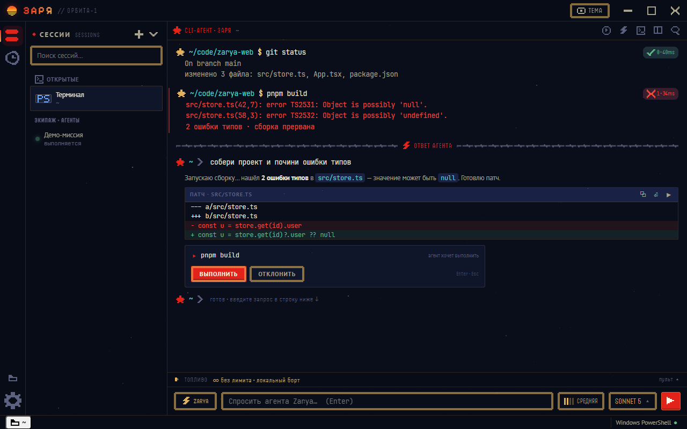
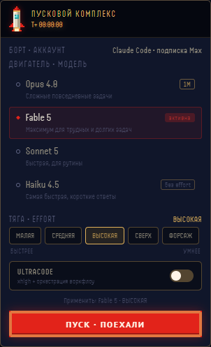
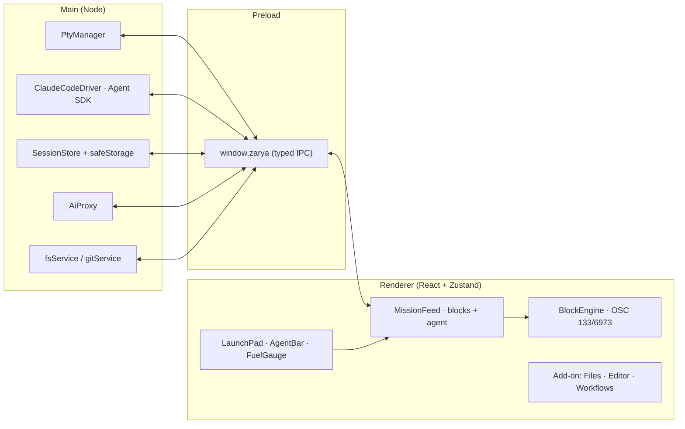

<div align="center">

# ЗАРЯ · Zarya

**Космический CLI-агент. A new dawn for your terminal.**

[](LICENSE)
[](CHANGELOG.md)
[](https://www.electronjs.org/)
[](#install)
[](CONTRIBUTING.md)

Zarya is an AI-native terminal with a Soviet space-age soul. It runs **Claude Code
natively** — the full agent, its tools and its permission prompts, driven straight
from your terminal — alongside Warp-style command blocks, persistent sessions, and an
optional built-in editor. 100% on your machine, no account, no telemetry.



</div>

## Highlights

- **🛰 Native Claude Code** — not a chat box bolted on. Zarya drives the real Claude
  Code agent through the Agent SDK: streaming replies, tool calls with inline
  approve/deny, the `AskUserQuestion` choice widget, session **resume**, and a live
  **fuel gauge** of your subscription limits — signed in with your **Max plan, no API
  key**.
- **🚀 Пусковой комплекс** — a cosmic launch console for picking the model and
  reasoning effort, with every current Claude version, live-switchable mid-session.
- **▚ Command blocks** — every command becomes a navigable block with output, exit
  code and duration, on the open OSC 133 standard.
- **💾 Persistent sessions** — scrollback, blocks and agent conversations survive a
  reboot; each conversation is bound to its terminal and its folder.
- **🧩 IDE as an add-on** — a Monaco editor, file tree and git diff you can switch on;
  **off by default**, so the base stays a clean terminal + agent.
- **🎨 Космос + конструктивизм** — deep-space navy, Soviet red, brass gold, a pixel
  wordmark and a live starfield, across 9 dark & light themes.

## Native Claude Code

Point the bottom bar at **Claude Code** (or just type `claude`) and Zarya becomes a
native GUI front-end for the agent — no terminal-scraping, no second chat window:

- **Signed in with your Max subscription** — the bundled CLI is driven over the Agent
  SDK's JSON control protocol; there is no API key to paste and nothing leaves your
  machine that wouldn't already via `claude`.
- **Real tools, real prompts** — `Bash`, `Edit`, `Write`, web fetch and the rest run in
  the agent, and each tool call surfaces as a card you **approve or deny** (Enter · Esc).
  The signature `AskUserQuestion` renders as a native multiple-choice widget, not text.
- **Resume anything** — past sessions for the current folder are one click away, and the
  next turn resumes with full context intact.
- **Dynamic models & effort** — the model list, per-model effort levels and **ultracode**
  come straight from the SDK, so new models appear without an update. Switch live: the
  change applies from your next message.
- **Fuel gauge** — a real read of your 5-hour / 7-day subscription utilization, plus the
  active model and effort, right above the input.
- **«Без спроса»** — an optional bypass that auto-approves ordinary tools (AskUserQuestion
  still always asks). Off by default; a one-click chip, live-toggleable.

Prefer to bring your own key? Zarya also has a **built-in provider agent** that talks to
**Anthropic**, **OpenAI**, **Ollama** (local inference, incl. a remote Ollama box on your
LAN or Tailscale) or any **OpenAI-compatible** endpoint — keys encrypted at rest, never
sent anywhere but the provider you configured.

## Пусковой комплекс — the Launch Pad



The signature control — a cosmic launch console instead of a boring dropdown. Every
current Claude model is version-qualified (**Opus 4.8**, **Fable 5**, **Sonnet 5**,
**Haiku 4.5**) with a one-line purpose and a live "активна" marker on whatever is
actually running. Pick a **двигатель** (model) and its **ТЯГА / effort** (from `МАЛАЯ`
to `ФОРСАЖ`, gated per model), flip **ULTRACODE** for xhigh + workflow orchestration,
and hit **ПУСК · ПОЕХАЛИ** — a pixel rocket lifts off as the settings apply.

The rocket stays collapsed to a slim strip while you browse and only unfolds for the
launch animation, so the picker reads like the CLI's own `/model`. Open it from the
model chip, the fuel strip, or `Ctrl+Alt+M`.

Everything is dynamic: the list, the effort levels and the default all come from the
SDK, so the pad is future-proof — the next model Anthropic ships just shows up.

<br clear="right" />

## The rest

### Ask-agent bar & modes
One input under the terminal, Warp-style: **Enter runs a shell command** by default.
A chip switches the bar between **Терминал** and **Claude Code**, and it auto-follows —
launching an interactive CLI (`claude`, `vim`, `ssh`, a TUI) flips into raw-terminal
mode automatically. Message queueing, `↑/↓` input history, `Esc` to interrupt and
approve/deny keys are all there.

### Blocks
Every command becomes a distinct, navigable block — command, output, exit code and
duration, shown as an instrument-panel pill (`✓ 0 · 40мс` / `✗ 7 · 3.4с`) — on the open
[OSC 133](docs/shell-integration.md) standard, not a proprietary protocol. Jump with
`Ctrl+↑` / `Ctrl+↓`, re-run, copy command/output, or export as Markdown.

### Persistent sessions
Closing Zarya — or the machine losing power — doesn't lose your work: scrollback,
blocks and **agent conversations** autosave and restore, each conversation re-bound to
its terminal and cwd (so Claude Code resumes the right thread). Open a terminal straight
into a bookmarked project folder from the sidebar `▾` menu, `Ctrl+Shift+O`, or a folder
drag-drop. Model: [docs/sessions.md](docs/sessions.md).

### IDE add-on («IDE-агент»)
An optional layer — **off by default** — that reveals a **Monaco** editor with a file
tree (git-status markers), a git diff view and a second built-in-provider agent. Toggle
it from the activity bar; the base app stays a clean terminal + Claude Code agent until
you opt in.

### Time Machine («Хроника»)
Global, cross-session command history (`Ctrl+R`) — every command with cwd, shell and
exit code, fuzzy-searchable across every session you've ever had.

### More
Workflows (parameterized snippets), Command Palette (`Ctrl+Shift+P`), splits & tabs
(persisted), ghost autosuggest, and a `ТЕМА` quick-cycle button.

### Themes — 9, dark and light

| Theme | Type | |
|---|---|---|
| Заря · Космос | dark | signature deep-space (default) |
| Заря · Восток | dark | red-dominant maroon space |
| Заря · Орбита | dark | teal oscilloscope |
| Заря · Спутник | dark | cold graphite + brass |
| Заря · Байконур | dark | warm launch-pad amber |
| Заря · Рассвет | dark | original sunrise |
| Заря · Плакат | **light** | constructivist poster paper |
| Заря · Полдень | **light** | warm cosmonaut daylight |
| Заря · Чертёж | **light** | blueprint on cool paper |

Switch in Центр управления → Внешний вид, or cycle with the `ТЕМА` button. Add your
own via `registerThemes()` — see [docs/themes.md](docs/themes.md).

## Keyboard shortcuts

Remappable in Центр управления → Клавиши (`Ctrl+,`). Full reference:
[docs/keybindings.md](docs/keybindings.md).

| Action | Default | | Action | Default |
|---|---|---|---|---|
| Command palette | `Ctrl+Shift+P` | | Launch Pad (model · effort) | `Ctrl+Alt+M` |
| Quick open (file) | `Ctrl+P` | | AI: natural language → command | `Ctrl+I` |
| Settings | `Ctrl+,` | | Global command history | `Ctrl+R` |
| Toggle sidebar | `Ctrl+B` | | New terminal in folder | `Ctrl+Shift+O` |
| New / close tab | `Ctrl+Shift+T` / `Ctrl+Shift+W` | | Split right / down | `Ctrl+Shift+D` / `Ctrl+Shift+S` |
| Previous / next block | `Ctrl+↑` / `Ctrl+↓` | | Find in terminal | `Ctrl+Shift+F` |

## Install

### Prebuilt (Windows)
Grab `Zarya-<version>-win-x64.exe` from the GitHub Releases page and run it — a per-user
installer, no admin required. A portable `.exe` is built alongside it.

### From source

```bash
git clone https://github.com/gorka2354/zarya-terminal.git
cd zarya-terminal
npm install
npm run dev          # development
npm run build        # bundle main/preload/renderer -> out/
npm run pack         # unpacked build -> release/win-unpacked
npx electron-builder # installer + portable -> release/
```

**Notes.** Node 20.14+ works for dev and build. Packaging uses **electron-builder 24**
(v26 requires Node ≥ 20.19). On macOS/Linux `electron-builder` produces a `.dmg` /
AppImage + `.deb`. Native Claude Code needs the bundled `@anthropic-ai/claude-agent-sdk`
and an existing `claude` login (`claude` in a terminal, once).

## Architecture

Standard three-process Electron app: **main** owns OS resources (PTYs, filesystem, git,
API keys, and the Claude Code driver), **preload** exposes one typed, whitelisted
`window.zarya` bridge, and the **renderer** (React 19 + Zustand 5) owns all UI and never
touches Node directly.



Visual & functional QA runs through an **offscreen harness** (`scripts/*.mjs`,
Playwright-Electron in an isolated `ZARYA_USER_DATA` instance) — driving the renderer,
the driver and the PTY regardless of the screen. Full write-up + IPC list:
[docs/architecture.md](docs/architecture.md).

## Shell integration

On spawn Zarya injects an integration script (PowerShell / bash / zsh) that emits
standard **OSC 133** prompt/command marks plus a private, nonce-signed **OSC 6973**
sequence carrying the exact command line — powering Blocks, Time Machine and cwd
tracking. `cmd.exe`, Fish and WSL run without integration.
Details: [docs/shell-integration.md](docs/shell-integration.md).

## Security & privacy

- **No account, no telemetry.** Zarya never phones home; the only outbound requests go
  to the AI provider you configure. Native Claude Code uses your existing `claude` login.
- **API keys encrypted at rest** via Electron `safeStorage` (DPAPI / Keychain / Secret
  Service) — never plaintext, never sent anywhere but the provider you set.
- **Hardened renderer** — `contextIsolation` + `sandbox`, a strict CSP (`script-src
  'self'`, no inline/eval), navigation locked to its own origin, and DOMPurify on all
  AI/tool output.
- **Untrusted repos** — the auto-run `git status`/diff neutralizes exec-capable
  repo-local config (`core.fsmonitor`, hooks, …) so opening a malicious folder can't run
  code in the main process.
- Terminal scrollback, history and conversations are stored **in cleartext** by design
  (only keys are encrypted) — see [SECURITY.md](SECURITY.md) for the threat model and how
  to disable persistence on shared machines.

## Contributing

Dev setup, code style, adding a theme/workflow/provider: [CONTRIBUTING.md](CONTRIBUTING.md).

## License

MIT — see [LICENSE](LICENSE). Bundled fonts (Pixelify Sans, Handjet, PT Sans, JetBrains
Mono) are under the [SIL Open Font License 1.1](https://openfontlicense.org/).
