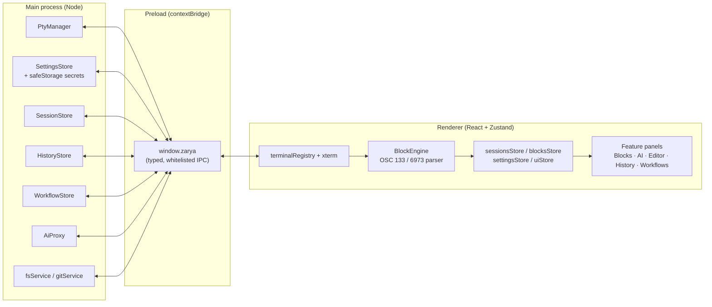

<div align="center">

# Zarya

**A new dawn for your terminal.**

[](LICENSE)
[](https://www.electronjs.org/)
[](#install)
[](CONTRIBUTING.md)

Zarya is an AI-native terminal with block-based command history, persistent sessions,
and a built-in editor — running 100% on your machine, with no account and no telemetry.


</div>

## Why Zarya

| | Zarya | Warp | Classic terminal |
|---|:---:|:---:|:---:|
| 100% local processing | ✅ | ❌ (cloud-assisted) | ✅ |
| No account required | ✅ | ❌ | ✅ |
| Open source | ✅ (MIT) | ❌ | varies |
| Bring-your-own-key AI | ✅ (Anthropic / OpenAI / Ollama / any OpenAI-compatible endpoint) | ❌ | — |
| Works fully offline | ✅ (with a local model via Ollama) | ❌ | ✅ |
| Command blocks & exit status | ✅ | ✅ | ❌ |
| Sessions survive a reboot | ✅ (scrollback + blocks) | partial | ❌ |

## Features

### Blocks
Every command becomes a distinct, navigable block — command, output, exit code and
duration, exactly like Warp — but built on the open [OSC 133](docs/shell-integration.md)
shell-integration standard rather than a proprietary protocol. Jump between blocks with
`Ctrl+↑` / `Ctrl+↓`, re-run, copy command/output, or export a block as Markdown.

### AI Assistant
Bring your own key. Zarya talks to **Anthropic**, **OpenAI**, **Ollama** (local inference,
including a remote Ollama box over Tailscale/LAN) or any **OpenAI-compatible** endpoint —
your choice, configured in Settings → AI. Keys never leave your machine unencrypted (see
[Privacy](#privacy)).

- **Agentic mode** — the assistant can call tools to inspect and run commands; every
  command execution is presented to you for confirmation before it runs. `autoApprove`
  exists to skip that confirmation, but it is **off by default** and should be enabled at
  your own risk.
- **Inline command bar** (`Ctrl+I`) — describe what you want in natural language, get a
  shell command back without leaving the terminal.
- **Ask AI about a block** — click **✦** on any command block (handy right after a
  failure) to open the AI panel with that block's command, output and exit code as
  context, and ask it to explain or suggest a fix.
- Context is scoped on purpose: only the last *N* blocks (configurable, default 3) are
  attached automatically. See [docs/ai.md](docs/ai.md) for exactly what gets sent.

### Persistent Sessions
Sessions are not just scrollback — closing Zarya (or the whole machine losing power)
does not lose your work:

- Autosaves scrollback + command blocks on an interval (default every 20s) and on a
  graceful-quit handshake between the window and the renderer.
- Restoring a session replays its scrollback and blocks, then starts a **fresh shell**
  in the saved working directory — there is no process reattachment.
- Pin or favorite sessions to keep them out of the 200-session prune.

Full model: [docs/sessions.md](docs/sessions.md).

### IDE-lite
A built-in **Monaco** editor pane with a file tree and git diff view, wired directly to
the terminal: click a file path printed in terminal output (with line:col suffix
support) and it opens at that line. Powered by native `fs`/`git` IPC in the main
process — no external LSP or extra process required.

### Time Machine
A global, cross-session command history (`Ctrl+R`) — every command you run, with its
cwd, shell and exit code, appended to a local JSONL log and searchable by fuzzy,
multi-token match across every session you've ever had, not just the current one.

### Workflows
Parameterized, reusable command snippets (`{{param}}` placeholders) — bring your own or
start from the bundled pack. Stored per-user, independent of any single session.

### Command Palette
`Ctrl+Shift+P` — every action in Zarya (tabs, splits, AI, blocks, view) is registered in
a single action registry and searchable from one place, no separate menu hunting.

### Themes
A small CSS-variable + xterm-color theme engine (`ThemeDef`) drives both the chrome and
the terminal palette from one source of truth. Ships with **Zarya Dawn** and
**Zarya Night** out of the box and is built to be extended — `registerThemes()` is a
one-call plugin point for adding more.

### Splits & tabs
Arbitrary row/column split trees per tab, drag-resizable gutters, independent shell per
pane. Tabs and layouts are part of the persisted workspace and restore on launch.

### Ghost autosuggest
Fish-style inline suggestions drawn from your cross-session command history while
you type at a prompt — press `→` to accept.

## Keyboard shortcuts

All chords are user-remappable in Settings → Keybindings (`Ctrl+,`); table below is the
shipped default (`DEFAULT_KEYBINDINGS` in `src/shared/defaults.ts`). Full reference with
remapping instructions: [docs/keybindings.md](docs/keybindings.md).

| Action | Default |
|---|---|
| Command palette | `Ctrl+Shift+P` |
| Quick open (file) | `Ctrl+P` |
| Settings | `Ctrl+,` |
| Toggle AI panel | `Ctrl+Shift+A` |
| Toggle sidebar | `Ctrl+B` |
| AI: natural language → command | `Ctrl+I` |
| Global command history (Time Machine) | `Ctrl+R` |
| New tab | `Ctrl+Shift+T` |
| Close tab | `Ctrl+Shift+W` |
| Next tab | `Ctrl+Tab` |
| Previous tab | `Ctrl+Shift+Tab` |
| Split right | `Ctrl+Shift+D` |
| Split down | `Ctrl+Shift+S` |
| Close pane | `Ctrl+Shift+X` |
| Focus next pane | `Alt+→` |
| Focus previous pane | `Alt+←` |
| Clear terminal | `Ctrl+Shift+K` |
| Find in terminal | `Ctrl+Shift+F` |
| Copy | `Ctrl+Shift+C` |
| Paste | `Ctrl+Shift+V` |
| Previous block | `Ctrl+↑` |
| Next block | `Ctrl+↓` |
| Copy last command's output | `Ctrl+Shift+O` |
| Increase font size | `Ctrl+=` |
| Decrease font size | `Ctrl+-` |
| Reset font size | `Ctrl+0` |

## Install

**Requirements:** Node.js **20.19+** or **22+** (electron-vite / Vite 6 requirement),
npm.

```bash
# Development
git clone https://github.com/gorka2354/zarya-terminal.git
cd zarya-terminal
npm install
npm run dev

# Production build for your current platform (out/ then release/)
npm run dist

# Unpacked build only (faster, for local testing)
npm run pack
```

`npm run dist` produces a Windows installer + portable exe (nsis/portable), a macOS
`.dmg`, or a Linux AppImage/`.deb`, depending on the host OS (`electron-builder.yml`).

## Architecture

Zarya is a standard three-process Electron app: the **main** process owns the OS-level
resources (PTYs, the filesystem, git, API keys), the **preload** script exposes a single
typed, whitelisted `window.zarya` bridge, and the **renderer** (React 19 + Zustand 5)
owns all UI state and never touches Node APIs directly.



Full write-up, IPC channel list and data-flow diagrams: [docs/architecture.md](docs/architecture.md).

## Shell integration

On spawn, Zarya injects a small integration script for the shell it starts (PowerShell,
bash, or zsh) that emits standard **OSC 133** prompt/command marks plus a private,
nonce-signed **OSC 6973** sequence carrying the exact command line — that's what powers
Blocks, Time Machine and cwd tracking. `cmd.exe`, Fish and WSL distros run without
integration (plain terminal, no blocks). Details and how to add your own shell:
[docs/shell-integration.md](docs/shell-integration.md).

## Privacy

- **API keys** are encrypted at rest with Electron's `safeStorage` (Windows DPAPI /
  macOS Keychain / Linux Secret Service) before touching disk — never plaintext, never
  sent anywhere but the provider you configured.
- **All data is local.** Sessions, history, workflows and settings live under
  `%APPDATA%/Zarya` (Windows) / the platform-equivalent `userData` directory — nothing
  syncs to a server Zarya controls, because there isn't one.
- **No telemetry, no account.** Zarya makes network requests only to the AI provider
  you explicitly configure.

## Contributing

Dev setup, code style and how to add a theme/workflow/provider: [CONTRIBUTING.md](CONTRIBUTING.md).

## License

MIT — see [LICENSE](LICENSE).

The default font stack is `'JetBrains Mono', 'Cascadia Mono', Consolas, monospace`.
JetBrains Mono is licensed under the [SIL Open Font License 1.1](https://github.com/JetBrains/JetBrainsMono/blob/master/OFL.txt)
by JetBrains s.r.o. and is **not bundled** with Zarya — install it separately for the
intended look, or Zarya falls back to the next font in the stack.
