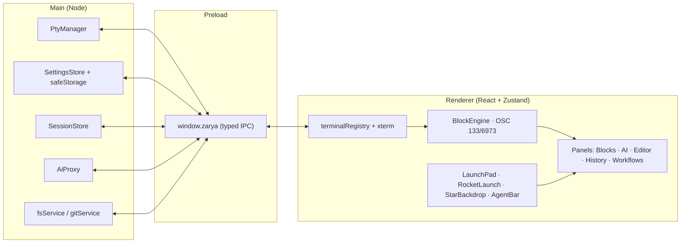

<div align="center">

# ЗАРЯ · Zarya

**Космический CLI-агент. A new dawn for your terminal.**

[](LICENSE)
[](CHANGELOG.md)
[](https://www.electronjs.org/)
[](#install)
[](CONTRIBUTING.md)

Zarya is an AI-native terminal with a Soviet space-age soul — block-based command
history, an agent with its own **Launch Pad**, persistent sessions, and a built-in
editor — running 100% on your machine, with no account and no telemetry.


</div>

## Why Zarya

| | Zarya | Warp | Classic terminal |
|---|:---:|:---:|:---:|
| 100% local processing | ✅ | ❌ (cloud-assisted) | ✅ |
| No account required | ✅ | ❌ | ✅ |
| Open source | ✅ (MIT) | ❌ | varies |
| Bring-your-own-key AI | ✅ (Anthropic / OpenAI / Ollama / any OpenAI-compatible) | ❌ | — |
| Works fully offline | ✅ (local model via Ollama) | ❌ | ✅ |
| Command blocks & exit status | ✅ | ✅ | ❌ |
| Sessions survive a reboot | ✅ (scrollback + blocks) | partial | ❌ |
| A rocket launches when you pick a model | ✅ 🚀 | ❌ | ❌ |

## The look — космос + конструктивизм

Zarya's chrome is a Soviet space-programme control panel: deep-space navy, Soviet
red and brass gold, constructivist geometry, a pixel **ЗАРЯ // ОРБИТА-1** wordmark
(Pixelify Sans) and dot-matrix tech labels (Handjet) over a live twinkling starfield.
Everything is theme-token driven, so the whole thing recolors — including a full set
of light "poster paper" themes for people who work on light backgrounds.

Fonts are **bundled offline** (no CDN, CSP-safe): Pixelify Sans, Handjet, PT Sans and
JetBrains Mono, all under the SIL Open Font License.

## Features

### Пусковой комплекс — the Launch Pad
The signature control. Instead of a boring model dropdown, Zarya has a **launch
console**: pick your **двигатель** (model) and **ТЯГА** (reasoning thrust — 4 levels
that drive temperature + token budget), hit **ПУСК · ПОЕХАЛИ**, and a rocket lifts
off across the screen as the settings apply. Open it from the model chip in the
ask-agent bar, the status bar, or `Ctrl+Alt+M`.


### Ask-agent bar
One unified input under the terminal: plain text goes to the AI agent, a line that
starts with `$` is a shell command written straight to the active terminal. The model
chip opens the Launch Pad; a **ТОПЛИВО** (fuel) strip sits on top.

### Blocks
Every command becomes a distinct, navigable block — command, output, exit code and
duration, shown as an instrument-panel pill (`✓ 0 · 40мс` / `✗ 1 · 3.4с`) — built on
the open [OSC 133](docs/shell-integration.md) shell-integration standard rather than a
proprietary protocol. Jump between blocks with `Ctrl+↑` / `Ctrl+↓`, re-run, copy
command/output, or export a block as Markdown.

### AI Assistant («Экипаж»)
Bring your own key. Zarya talks to **Anthropic**, **OpenAI**, **Ollama** (local
inference, including a remote Ollama box over Tailscale/LAN) or any **OpenAI-compatible**
endpoint. Keys never leave your machine unencrypted (see [Privacy](#privacy)).

- **Agentic mode** — the assistant can call tools to inspect and run commands; every
  command execution is presented to you for confirmation (`ВЫПОЛНИТЬ` / `ОТКЛОНИТЬ`)
  before it runs. `autoApprove` skips that confirmation, but it is **off by default**.
- **Reasoning thrust (ТЯГА)** — a 4-level effort dial that scales temperature and the
  token budget. Set it in the Launch Pad or Центр управления → AI.
- **Patch cards** — a ` ```diff ` block in a reply renders as a **ПАТЧ** card with
  red/green lines and copy/insert actions.
- **Inline command bar** (`Ctrl+I`) — natural language → shell command.
- **Ask AI about a block** — one click on any command block opens the agent with that
  block's command, output and exit code as context.
- Untrusted terminal output injected as context is **spotlighted** in the system prompt
  (OWASP LLM01 mitigation). See [docs/ai.md](docs/ai.md).

### Persistent Sessions
Closing Zarya — or the whole machine losing power — does not lose your work:

- Autosaves scrollback + command blocks on an interval and on a graceful-quit handshake.
- Restoring replays scrollback + blocks, then starts a **fresh shell** in the saved cwd.
- Pin or favorite sessions to keep them out of the 200-session prune.
- The sidebar frames running agents as **«Экипаж · агенты»** (crew).

Full model: [docs/sessions.md](docs/sessions.md).

### IDE-lite («IDE-агент»)
A built-in **Monaco** editor with a file tree (git-status markers) and git diff view,
wired to the terminal: click a file path in output (with `line:col` support) and it
opens at that line. A collapsed **IDE-АГЕНТ** rail keeps it one click away.

### Time Machine («Хроника»)
Global, cross-session command history (`Ctrl+R`) — every command with cwd, shell and
exit code, fuzzy-searchable across every session you've ever had.

### More
Workflows (parameterized snippets, themed presets), Command Palette (`Ctrl+K` /
`Ctrl+Shift+P`), splits & tabs (persisted), ghost autosuggest, a boot handshake, and
a `ТЕМА` quick-cycle button.

### Themes — 9, dark and light

| Theme | Type | |
|---|---|---|
| Заря · Космос | dark | signature deep-space (default) |
| Заря · Восток | dark | red-dominant maroon space |
| Заря · Орбита | dark | teal oscilloscope |
| Заря · Спутник | dark | cold graphite + brass |
| Заря · Байконур | dark | warm launch-pad amber |
| Заря · Рассвет | dark | original sunrise |
| Заря · Плакат | **light** | constructivist poster paper |
| Заря · Полдень | **light** | warm cosmonaut daylight |
| Заря · Чертёж | **light** | blueprint on cool paper |

Switch in Центр управления → Внешний вид, or cycle with the `ТЕМА` button. Add your
own via `registerThemes()` — see [docs/themes.md](docs/themes.md).

## Keyboard shortcuts

Remappable in Центр управления → Клавиши (`Ctrl+,`); this is the shipped default
(`DEFAULT_KEYBINDINGS`). Full reference: [docs/keybindings.md](docs/keybindings.md).

| Action | Default |
|---|---|
| Command palette | `Ctrl+Shift+P` |
| Quick open (file) | `Ctrl+P` |
| Settings (Центр управления) | `Ctrl+,` |
| Launch Pad (model · thrust) | `Ctrl+Alt+M` |
| Toggle AI panel | `Ctrl+Shift+A` |
| AI: natural language → command | `Ctrl+I` |
| Global command history | `Ctrl+R` |
| Toggle sidebar | `Ctrl+B` |
| New / close tab | `Ctrl+Shift+T` / `Ctrl+Shift+W` |
| Next / previous tab | `Ctrl+Tab` / `Ctrl+Shift+Tab` |
| Split right / down | `Ctrl+Shift+D` / `Ctrl+Shift+S` |
| Previous / next block | `Ctrl+↑` / `Ctrl+↓` |
| Find in terminal | `Ctrl+Shift+F` |

## Install

### Prebuilt (Windows)
Grab `Zarya-<version>-win-x64.exe` from the `release/` output (or the GitHub Releases
page) and run it — a per-user installer, no admin required. A portable `.exe` is built
alongside it.

### From source

```bash
git clone https://github.com/gorka2354/zarya-terminal.git
cd zarya-terminal
npm install
npm run dev                 # development
npm run build              # bundle main/preload/renderer -> out/
npx electron-builder       # installer + portable -> release/
```

**Notes.** Node 20.14+ works for dev and build. Packaging uses **electron-builder 24**
(v26 requires Node ≥ 20.19 for a `require(ESM)` dependency). On macOS/Linux
`electron-builder` produces a `.dmg` / AppImage+`.deb` instead.

## Architecture

Standard three-process Electron app: **main** owns OS resources (PTYs, filesystem, git,
API keys), **preload** exposes one typed, whitelisted `window.zarya` bridge, and the
**renderer** (React 19 + Zustand 5) owns all UI and never touches Node directly.



Visual QA runs through an **offscreen harness** (`scripts/shoot.mjs`, Playwright-Electron
in an isolated `ZARYA_USER_DATA` instance) — screenshots the renderer regardless of the
screen. Full write-up + IPC list: [docs/architecture.md](docs/architecture.md).

## Shell integration

On spawn Zarya injects an integration script (PowerShell / bash / zsh) that emits
standard **OSC 133** prompt/command marks plus a private, nonce-signed **OSC 6973**
sequence carrying the exact command line — powering Blocks, Time Machine and cwd
tracking. `cmd.exe`, Fish and WSL run without integration. Details:
[docs/shell-integration.md](docs/shell-integration.md).

## Privacy

- **API keys** are encrypted at rest with Electron `safeStorage` (Windows DPAPI / macOS
  Keychain / Linux Secret Service) — never plaintext, never sent anywhere but the
  provider you configured. The renderer can't redirect a keyed request to another host.
- **All data is local**, under `%APPDATA%/Zarya` (or the platform `userData` dir).
- **No telemetry, no account.** Network requests go only to the AI provider you set.

## Contributing

Dev setup, code style, adding a theme/workflow/provider: [CONTRIBUTING.md](CONTRIBUTING.md).

## License

MIT — see [LICENSE](LICENSE). Bundled fonts (Pixelify Sans, Handjet, PT Sans, JetBrains
Mono) are under the [SIL Open Font License 1.1](https://openfontlicense.org/).
