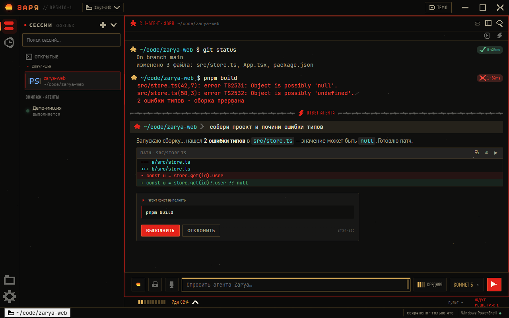
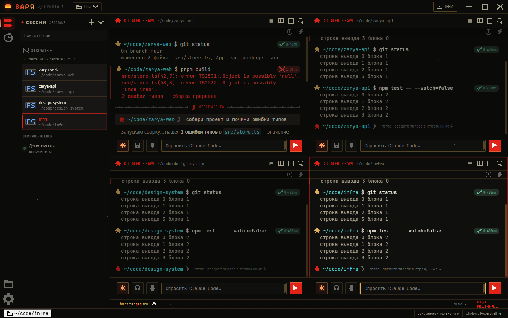
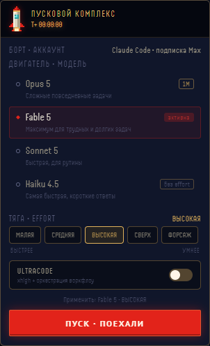
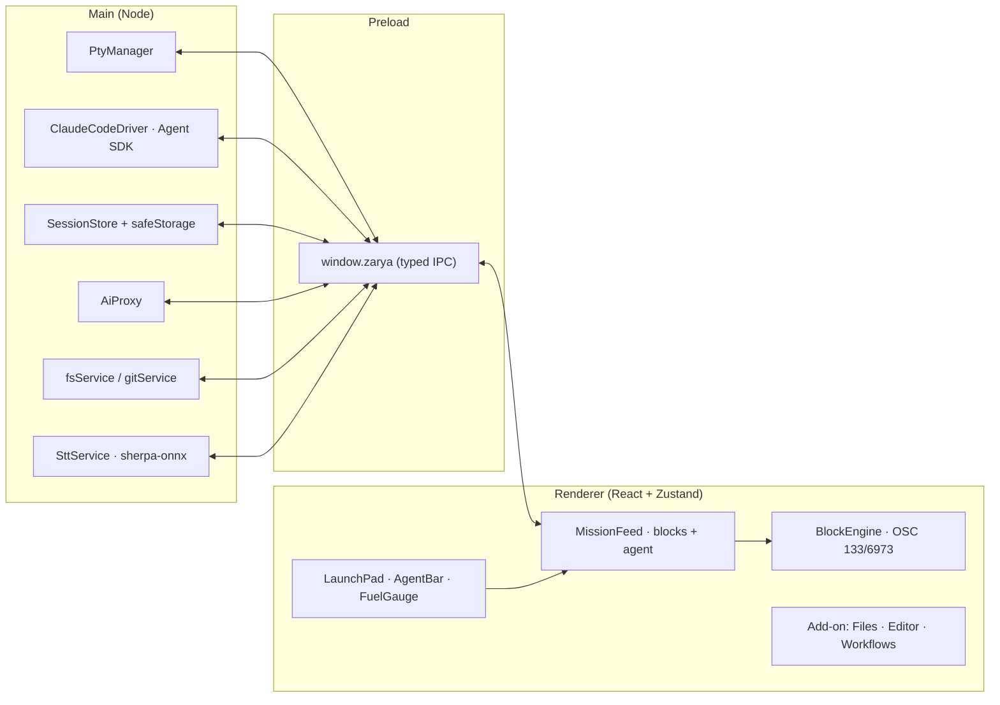

<div align="center">

# ЗАРЯ · Zarya

**A space-age CLI agent. A new dawn for your terminal.**

*Zarya (Заря) — “dawn”, and the name of the first module of the ISS.*

[](LICENSE)
[](CHANGELOG.md)
[](#language)
[](https://www.electronjs.org/)
[](#install)
[](CONTRIBUTING.md)

Zarya is an AI-native terminal with a Soviet space-age soul. It runs **Claude Code
natively** — the full agent, its tools and its permission prompts, driven straight
from your terminal — and gives every **pane its own agent**, so four CLIs can work
side by side without ever sharing a conversation. Warp-style command blocks,
persistent sessions and an optional built-in editor come along. 100% on your machine,
no account, no telemetry.



</div>

## Highlights

- **🛰 Native Claude Code** — not a chat box bolted on. Zarya drives the real Claude
  Code agent through the Agent SDK: streaming replies, tool calls with inline
  approve/deny, the `AskUserQuestion` choice widget, session **resume**, and a live
  **fuel gauge** of your subscription limits — signed in with your **Max plan, no API
  key**.
- **▦ Panes are whole CLIs** — split the window and each pane keeps its own feed, its
  own input line, its own mode and its own autopilot. One Enter approves a tool in the
  **framed** pane and nowhere else. The sidebar lists the panes of the active desk, so
  you can point at one with the mouse; drag a pane by its header to move it next to
  another (the edge you aim at lights up) or into the list to give it a desk of its own —
  without killing the process.
- **🚀 Launch Pad** — a cosmic launch console for picking the model and reasoning
  effort (`LOW` → `AFTERBURNER`), with every current Claude version, live-switchable
  mid-session.
- **🎙 Dictation — offline speech-to-text** — hold `Ctrl+Shift+Space`, speak, and the
  text lands in the input. Runs entirely on your machine ([sherpa-onnx](https://github.com/k2-fsa/sherpa-onnx)
  + [GigaAM](https://github.com/salute-developers/GigaAM), strong on Russian): no
  network, no cloud key, and the audio is never written to disk. Recognised text is
  **inserted, not sent** — you read it before Enter.
- **▚ Command blocks** — every command becomes a navigable block with output, exit
  code and duration, on the open OSC 133 standard.
- **💾 Persistent sessions** — scrollback, blocks and agent conversations survive a
  reboot; each conversation is bound to its terminal and its folder.
- **🧩 IDE as an add-on** — a Monaco editor, file tree and git diff you can switch on;
  **off by default**, so the base stays a clean terminal + agent.
- **🌐 Two languages, one build** — the entire interface is English or Russian, switched
  instantly in settings, no restart and no second installer. Follows your system
  language on first launch; the built-in agent answers in the language you picked.
- **🎨 Kosmos + constructivism** — deep-space navy, Soviet red, brass gold, a pixel
  wordmark and a live starfield, across 9 dark & light themes.

## Language

Zarya ships both languages inside one build. On first launch it follows your system
language; **Settings → Appearance → Language** pins English or Russian either way, and
the switch takes effect immediately — the dictionaries are already in the app, so
there is nothing to download, restart or sign into again.

The space-age framing is translated rather than dropped: Mission Control, the launch
pad, thrust levels (`LOW` → `AFTERBURNER`), the `// ORBIT-1` tagline and the ship
themes (Kosmos, Vostok, Baikonur, Blueprint) read as themselves in English. The
built-in agent is told to answer in the interface language, and so do the system
dialogs the main process shows.

Your own data is never translated: terminal output, agent answers, paths, session
names and command history stay exactly as you typed or received them.

Release notes and the changelog exist in both languages —
[CHANGELOG.md](CHANGELOG.md) in English, [CHANGELOG.ru.md](CHANGELOG.ru.md) in Russian.

## Native Claude Code

Point the bottom bar at **Claude Code** (or just type `claude`) and Zarya becomes a
native GUI front-end for the agent — no terminal-scraping, no second chat window:

- **Signed in with your Max subscription** — the bundled CLI is driven over the Agent
  SDK's JSON control protocol; there is no API key to paste and nothing leaves your
  machine that wouldn't already via `claude`.
- **Real tools, real prompts** — `Bash`, `Edit`, `Write`, web fetch and the rest run in
  the agent, and each tool call surfaces as a card you **approve or deny** (Enter · Esc).
  The signature `AskUserQuestion` renders as a native multiple-choice widget, not text.
- **Resume anything** — past sessions for the current folder are one click away, and the
  next turn resumes with full context intact.
- **Dynamic models & effort** — the model list, per-model effort levels and **ultracode**
  come straight from the SDK, so new models appear without an update. Switch live: the
  change applies from your next message.
- **Fuel gauge** — a real read of your 5-hour / 7-day subscription utilization, plus the
  active model and effort, right above the input.
- **Bypass mode** — an optional switch that auto-approves ordinary tools (AskUserQuestion
  still always asks). Off by default; a one-click chip, live-toggleable.

Prefer to bring your own key? Zarya also has a **built-in provider agent** that talks to
**Anthropic**, **OpenAI**, **Ollama** (local inference, incl. a remote Ollama box on your
LAN or Tailscale) or any **OpenAI-compatible** endpoint — keys encrypted at rest, never
sent anywhere but the provider you configured.

## Panes — four CLIs in one window



A tab is a **desk**, a pane is a **CLI**. Up to four panes share a desk; the fifth opens
a desk of its own, because past four the feed collapses into a strip of lines.

- **Nothing is shared.** Feed, input line, mode, autopilot, attachments, input history —
  all per pane. A full-screen program (`vim`, `htop`) takes over *its* pane only.
- **The frame never lies.** The accented border marks the pane that receives `Enter` and
  `Esc` — i.e. where a tool approval will land. The sidebar mirrors it: a subtle
  background means «on screen», the accent means «in focus», and there is exactly one.
- **Layout is a rule, not a chore.** One pane fills the desk, two-three go in columns,
  four make a 2×2 grid. Close one and the rest re-flow — unless you dragged a divider,
  in which case your layout is yours and stays untouched.
- **Move or detach.** Grab a pane by its header: drop it on another pane and it docks to
  the **edge you aim at** (the half it will take lights up first); drop it into the
  sidebar and it leaves the grid for its own desk. The process never restarts.
- **Desks have names.** Built from the panes («zarya-web + zarya-api +2») or your own —
  rename with a double click.

## The Launch Pad



The signature control — a cosmic launch console instead of a boring dropdown. Every
current Claude model is version-qualified (**Opus 4.8**, **Fable 5**, **Sonnet 5**,
**Haiku 4.5**) with a one-line purpose and a live "active" marker on whatever is
actually running. Pick an **engine** (model) and its **thrust / effort** (from `LOW`
to `AFTERBURNER`, gated per model), flip **ULTRACODE** for xhigh + workflow
orchestration, and hit **LAUNCH · POYEKHALI** — a pixel rocket lifts off as the
settings apply.

The rocket stays collapsed to a slim strip while you browse and only unfolds for the
launch animation, so the picker reads like the CLI's own `/model`. Open it from the
model chip, the fuel strip, or `Ctrl+Alt+M`.

Everything is dynamic: the list, the effort levels and the default all come from the
SDK, so the pad is future-proof — the next model Anthropic ships just shows up.

<br clear="right" />

## The rest

### Ask-agent bar & modes
One input under the terminal, Warp-style: **Enter runs a shell command** by default,
`Shift+Enter` / `Ctrl+Enter` add a line. A chip switches the bar between **Terminal**
and the agents, and it auto-follows — launching an interactive CLI (`claude`, `vim`,
`ssh`, a TUI) flips into raw-terminal mode automatically. Message queueing, `↑/↓`
input history, `Esc` to interrupt and approve/deny keys are all there.

The bar carries one figure of your limits — whichever window is closest to running
out — and opens the rest on click: a line per limit with its own gauge and reset time.
Engine and permission mode are icons; their labels live in tooltips, but the gate
**keeps its colour**, because «will I be asked?» must be readable without hovering.

### Dictation (voice input)
Click the microphone or hold `Ctrl+Shift+Space`. Click-mode stops itself after a
second and a half of silence; `Esc` cancels. While recording, the button **is** the
indicator — it pulses and shows the input level, because a microphone must never be
open without you knowing.

The model (~225 MB) is downloaded on first use with a checksum check, not bundled,
and cached under your user data. Everything after that is local: no request leaves
the machine, and the audio exists only in memory while you speak.

**Choosing the microphone.** Right-click the mic button (or Settings → Voice) to pick
the input device; the default follows your OS. The choice is stored with the device
name as well as its id, because Chromium's per-origin device ids change when a driver
is reinstalled — so the same headset is re-bound silently instead of dictation quietly
falling back to the laptop's built-in mic. If the device really is gone, Zarya says so
and records into the system default rather than failing or pretending.

### Update check
Zarya makes **one anonymous GET** to the GitHub releases API at startup — no token,
no identifiers, no telemetry — and shows a dot in the activity bar when a newer
version exists. Behind it: a **"What's new" page** with the release notes, the files
with their sizes, and the **SHA256** of each so you can verify what you downloaded.
Turn it off in Settings → About.

Zarya never downloads or launches anything on its own. Every URL on that page is
**built by the app** from a hardcoded repo constant and a validated tag — never
taken from the API response — and links inside the release notes are rendered
inert, because the only legitimate destinations are the ones Zarya constructs
itself.

One-click install is gated on a **release signature**. The checksum list of every
release is signed with an Ed25519 key that lives on the maintainer's machine and
is *not* in CI; the app carries the public half and refuses to self-install
anything it cannot verify — signature over the checksum list, then sha256 of the
downloaded installer against that list. Without it, the integrity chain would be
CI vouching for CI: a compromised pipeline would produce a valid checksum for a
compromised build, and with auto-update that is silent code execution on every
machine. An unsigned release is still installable — by hand, from the release
page, with the SHA256 shown next to each file. Note this is *not* Authenticode:
the executables themselves carry no certificate, so SmartScreen still warns.
Maintainer flow: `node scripts/gen-signing-key.mjs` once, then
`node scripts/sign-release.mjs <version>` after every release.

### Blocks
Every command becomes a distinct, navigable block — command, output, exit code and
duration, shown as an instrument-panel pill (`✓ 0 · 40ms` / `✗ 7 · 3.4s`) — on the open
[OSC 133](docs/shell-integration.md) standard, not a proprietary protocol. Jump with
`Ctrl+↑` / `Ctrl+↓`, re-run, copy command/output, or export as Markdown.

### Persistent sessions
Closing Zarya — or the machine losing power — doesn't lose your work: scrollback,
blocks and **agent conversations** autosave and restore, each conversation re-bound to
its terminal and cwd (so Claude Code resumes the right thread). Open a terminal straight
into a bookmarked project folder from the sidebar `▾` menu, `Ctrl+Shift+O`, or a folder
drag-drop. Model: [docs/sessions.md](docs/sessions.md).

### IDE add-on
An optional layer — **off by default** — that reveals a **Monaco** editor with a file
tree (git-status markers), a git diff view and a second built-in-provider agent. Toggle
it from the activity bar; the base app stays a clean terminal + Claude Code agent until
you opt in.

### Time Machine
Global, cross-session command history (`Ctrl+R`) — every command with cwd, shell and
exit code, fuzzy-searchable across every session you've ever had.

### Images
Paste (`Ctrl+V`) or drop a picture into the bar and it attaches to **that** pane, shows
as a chip before you send, and is scaled down to the model's limit. An engine that
cannot read images says so out loud instead of swallowing the attachment.

### More
Workflows (parameterized snippets), Command Palette (`Ctrl+Shift+P`), tabs and panes
(persisted across restarts), ghost autosuggest, and a `THEME` quick-cycle button.

### Themes — 9, dark and light

| Theme | Type | |
|---|---|---|
| Zarya · Kosmos | dark | signature deep-space (default) |
| Zarya · Vostok | dark | red-dominant maroon space |
| Zarya · Orbit | dark | teal oscilloscope |
| Zarya · Sputnik | dark | cold graphite + brass |
| Zarya · Baikonur | dark | warm launch-pad amber |
| Zarya · Dawn | dark | original sunrise |
| Zarya · Poster | **light** | constructivist poster paper |
| Zarya · Noon | **light** | warm cosmonaut daylight |
| Zarya · Blueprint | **light** | blueprint on cool paper |

Switch in Mission Control → Appearance, or cycle with the `THEME` button. Add your
own via `registerThemes()` — see [docs/themes.md](docs/themes.md).

## Keyboard shortcuts

Remappable in Mission Control → Keys (`Ctrl+,`). Full reference:
[docs/keybindings.md](docs/keybindings.md).

| Action | Default | | Action | Default |
|---|---|---|---|---|
| Command palette | `Ctrl+Shift+P` | | Launch Pad (model · effort) | `Ctrl+Alt+M` |
| Quick open (file) | `Ctrl+P` | | AI: natural language → command | `Ctrl+I` |
| Settings | `Ctrl+,` | | Global command history | `Ctrl+R` |
| Toggle sidebar | `Ctrl+B` | | New terminal in folder | `Ctrl+Shift+O` |
| New / close tab | `Ctrl+Shift+T` / `Ctrl+Shift+W` | | Split right / down | `Ctrl+Shift+D` / `Ctrl+Shift+S` |
| Close pane | `Ctrl+Shift+X` | | Focus next pane | `Alt+→` |
| Previous / next block | `Ctrl+↑` / `Ctrl+↓` | | Find in terminal | `Ctrl+Shift+F` |
| Dictate (hold) | `Ctrl+Shift+Space` | | New line in the bar | `Shift+Enter` |

## Install

### Prebuilt (Windows)
Grab `Zarya-<version>-win-x64.exe` from the GitHub Releases page and run it — a per-user
installer, no admin required. A portable `.exe` is built alongside it.

### From source

```bash
git clone https://github.com/gorka2354/zarya-terminal.git
cd zarya-terminal
npm install
npm run dev          # development
npm run build        # bundle main/preload/renderer -> out/
npm run pack         # unpacked build -> release/win-unpacked
npx electron-builder # installer + portable -> release/
```

**Notes.** Node 20.14+ works for dev and build. Packaging uses **electron-builder 24**
(v26 requires Node ≥ 20.19). On macOS/Linux `electron-builder` produces a `.dmg` /
AppImage + `.deb`. Native Claude Code needs the bundled `@anthropic-ai/claude-agent-sdk`
and an existing `claude` login (`claude` in a terminal, once).

## Architecture

Standard three-process Electron app: **main** owns OS resources (PTYs, filesystem, git,
API keys, and the Claude Code driver), **preload** exposes one typed, whitelisted
`window.zarya` bridge, and the **renderer** (React 19 + Zustand 5) owns all UI and never
touches Node directly.


```mermaid
flowchart LR
    subgraph Main["Main (Node)"]
        PTY[PtyManager]
        CC[ClaudeCodeDriver · Agent SDK]
        SESS[SessionStore + safeStorage]
        AI[AiProxy]
        FS[fsService / gitService]
        STT[SttService · sherpa-onnx]
    end
    subgraph Bridge["Preload"]
        API["window.zarya (typed IPC)"]
    end
    subgraph Renderer["Renderer (React + Zustand)"]
        FEED[MissionFeed · blocks + agent]
        BE[BlockEngine · OSC 133/6973]
        UI[LaunchPad · AgentBar · FuelGauge]
        IDE[Add-on: Files · Editor · Workflows]
    end
    PTY <--> API
    CC <--> API
    SESS <--> API
    AI <--> API
    FS <--> API
    STT <--> API
    API <--> FEED
    FEED --> BE
    UI --> FEED
```

Visual & functional QA runs through an **offscreen harness** (`scripts/*.mjs`,
Playwright-Electron in an isolated `ZARYA_USER_DATA` instance) — driving the renderer,
the driver and the PTY regardless of the screen. Full write-up + IPC list:
[docs/architecture.md](docs/architecture.md).

## Shell integration

On spawn Zarya injects an integration script (PowerShell / bash / zsh) that emits
standard **OSC 133** prompt/command marks plus a private, nonce-signed **OSC 6973**
sequence carrying the exact command line — powering Blocks, Time Machine and cwd
tracking. `cmd.exe`, Fish and WSL run without integration.
Details: [docs/shell-integration.md](docs/shell-integration.md).

## Security & privacy

- **No account, no telemetry.** Zarya never phones home; the only outbound requests go
  to the AI provider you configure. Native Claude Code uses your existing `claude` login.
- **API keys encrypted at rest** via Electron `safeStorage` (DPAPI / Keychain / Secret
  Service) — never plaintext, never sent anywhere but the provider you set.
- **Hardened renderer** — `contextIsolation` + `sandbox`, a strict CSP (`script-src
  'self'`, no inline/eval), navigation locked to its own origin, and DOMPurify on all
  AI/tool output.
- **Untrusted repos** — the auto-run `git status`/diff neutralizes exec-capable
  repo-local config (`core.fsmonitor`, hooks, …) so opening a malicious folder can't run
  code in the main process.
- **Approval gates you can actually read.** One switch per engine weakens a gate and
  the bar always shows which; every request gets a card, and while it waits for your
  answer the command is pinned open — no fold, no ellipsis, no inner scrollbar.
- **Voice stays on the machine.** Recognition is local; the microphone opens only on an
  explicit action, is visibly indicated while open, and closes with the take. Browser
  permissions are an explicit allow-list (microphone + clipboard, this window only).
- **Terminal profiles** — a stored profile is a program the app will launch, so adding
  or editing one needs your confirmation, with the path, arguments and environment
  shown.
- Terminal scrollback, history and conversations are stored **in cleartext** by design
  (only keys are encrypted) — see [SECURITY.md](SECURITY.md) for the threat model and how
  to disable persistence on shared machines.

## Contributing

Dev setup, code style, adding a theme/workflow/provider: [CONTRIBUTING.md](CONTRIBUTING.md).

## License

MIT — see [LICENSE](LICENSE). Bundled fonts (Pixelify Sans, Handjet, PT Sans, JetBrains
Mono) are under the [SIL Open Font License 1.1](https://openfontlicense.org/).
