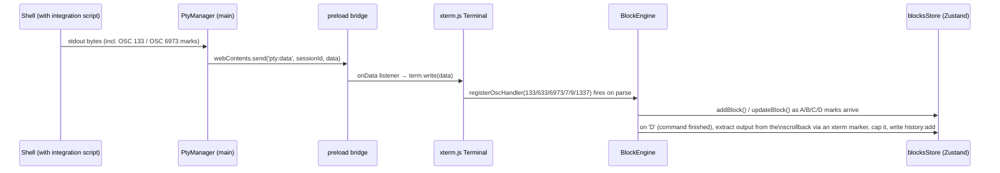
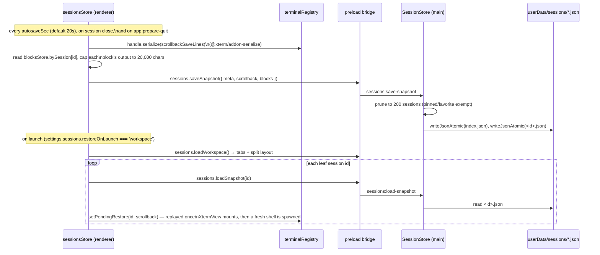

# Architecture

Zarya is a standard three-process Electron app. This document covers process
boundaries, the full IPC surface, and the two data flows that matter most: terminal
output turning into blocks, and a session turning into a durable snapshot.

## Processes

```mermaid
flowchart TB
    subgraph MAIN["Main process — src/main (Node.js, full OS access)"]
        direction LR
        Index[index.ts\nBrowserWindow · app lifecycle]
        Ipc[ipc.ts\nregisterIpc]
        PtyMgr[ptyManager.ts\n@lydell/node-pty]
        SettingsS[settingsStore.ts\nsettings.json + secrets.json]
        SessionS[sessionStore.ts\nsessions/*.json]
        HistoryS[historyStore.ts\nhistory.jsonl]
        WorkflowS[workflowStore.ts\nworkflows.json]
        AiP[aiProxy.ts\nfetch to provider APIs]
        FsSvc[fsService.ts]
        GitSvc[gitService.ts]
        ShellP[shellProfiles.ts\nshell detection]
    end

    subgraph PRELOAD["Preload — src/preload/index.ts"]
        Bridge["contextBridge.exposeInMainWorld('zarya', api)\ncontextIsolation: true, sandbox: true"]
    end

    subgraph RENDERER["Renderer — src/renderer/src (React 19 + Zustand 5)"]
        direction LR
        TermReg[terminalRegistry.ts]
        Xterm[XtermView.tsx\n@xterm/xterm 6]
        BlockEng[blockEngine.ts\nOSC parser]
        Stores[Zustand stores\nsessions/blocks/settings/ui]
        Panels[Feature panels]
    end

    Index --> Ipc
    Ipc --> PtyMgr & SettingsS & SessionS & HistoryS & WorkflowS & AiP & FsSvc & GitSvc & ShellP
    Ipc <-->|ipcMain.handle / .on\nwebContents.send| Bridge
    Bridge <-->|window.zarya.*| TermReg
    TermReg --> Xterm --> BlockEng --> Stores --> Panels
```

- **Main** never renders UI and the renderer never imports Node built-ins — the preload
  bridge (`src/preload/index.ts`, typed by `src/preload/index.d.ts`) is the *only*
  crossing point, and it's a fixed, whitelisted method surface (no
  `ipcRenderer.invoke` exposed directly to the page). `contextIsolation: true` and
  `sandbox: true` are set on the `BrowserWindow` in `src/main/index.ts`.
- **API keys** live only in the main process (`SettingsStore`, backed by
  `safeStorage`); `AiProxy` reads them internally when it makes the actual HTTP
  request, so a raw key is never serialized across the IPC boundary at all.
- Every persisted store (`sessionStore`, `settingsStore`, `historyStore`,
  `workflowStore`) reads/writes plain JSON (or JSONL for history) via `jsonStore.ts`,
  which does atomic writes (temp file + rename) and serializes concurrent writes to the
  same path per-file.

## IPC channels

All channel names are defined once in `src/shared/ipc.ts` (`CH`) and consumed by both
`src/main/ipc.ts` and `src/preload/index.ts` — there is a single source of truth, so a
typo can't silently create two different channel strings.

| Channel | Direction | Purpose |
|---|---|---|
| `pty:spawn` | renderer → main (invoke) | Resolve a shell profile and start a PTY for a session id |
| `pty:write` | renderer → main (send) | Write raw bytes to a PTY |
| `pty:resize` | renderer → main (send) | Resize a PTY (cols/rows) |
| `pty:kill` | renderer → main (send) | Kill a PTY |
| `pty:data` | main → renderer | PTY stdout/stderr chunk |
| `pty:exit` | main → renderer | PTY process exited (exit code) |
| `sessions:list` | renderer → main (invoke) | List saved session metadata |
| `sessions:save-snapshot` | renderer → main (invoke) | Persist meta + scrollback + blocks for one session |
| `sessions:load-snapshot` | renderer → main (invoke) | Load a saved snapshot by id |
| `sessions:delete` | renderer → main (invoke) | Delete a saved session |
| `sessions:set-flag` | renderer → main (invoke) | Toggle `pinned` / `favorite` |
| `sessions:rename` | renderer → main (invoke) | Rename a session |
| `sessions:save-workspace` | renderer → main (invoke) | Persist tabs/splits/active tab |
| `sessions:load-workspace` | renderer → main (invoke) | Load the last workspace layout |
| `app:prepare-quit` | main → renderer | "Snapshot everything now, quit is imminent" |
| `app:ready-to-quit` | renderer → main (send) | Renderer's ack after snapshotting on quit |
| `settings:get` | renderer → main (invoke) | Full settings object |
| `settings:set` | renderer → main (invoke) | Deep-merge patch, persisted + broadcast |
| `settings:changed` | main → renderer | Push settings to all windows on any change |
| `settings:set-secret` | renderer → main (invoke) | Store an encrypted API key for a provider |
| `settings:provider-status` | renderer → main (invoke) | Which providers have a key set (never the key itself) |
| `shells:detect` | renderer → main (invoke) | Auto-detected + custom shell profiles |
| `ai:chat` | renderer → main (send) | Start a streamed chat request (see `AiChatRequest`) |
| `ai:abort` | renderer → main (send) | Abort an in-flight chat request |
| `ai:stream` | main → renderer | Streamed `AiStreamEvent` (text/tool_use/done/error) |
| `ai:ollama-models` | renderer → main (invoke) | List models from a local/remote Ollama instance |
| `fs:read-dir` / `fs:read-file` / `fs:write-file` / `fs:stat` / `fs:create` / `fs:rename` / `fs:delete` | renderer → main (invoke) | File tree + editor operations (delete moves to OS trash) |
| `git:status` | renderer → main (invoke) | Porcelain v2 status for a cwd's repo |
| `git:diff-file` | renderer → main (invoke) | HEAD vs working-tree content for one file |
| `history:add` | renderer → main (invoke) | Append one command to the global history log |
| `history:search` | renderer → main (invoke) | Fuzzy multi-token search across all history |
| `workflows:list` / `:save` / `:delete` | renderer → main (invoke) | User + builtin workflow snippets |
| `app:info` | renderer → main (invoke) | Version/platform/electron/chrome/node/userData path |
| `window:command` | renderer → main (send) | minimize / maximize / close / devtools |
| `window:maximized` | main → renderer | Maximize-state change (for the custom titlebar) |
| `app:open-external` | renderer → main (send) | Open an `http(s)://` URL in the OS browser |
| `app:show-item-in-folder` | renderer → main (send) | Reveal a path in the OS file manager |
| `app:pick-directory` | renderer → main (invoke) | Native "choose folder" dialog |
| `app:set-opacity` | renderer → main (send) | Live window opacity (0.3–1.0) |

## Data flow: PTY → terminal → blocks



`BlockEngine` (`src/renderer/src/terminal/blockEngine.ts`) is a pure consumer of xterm's
OSC parser — it does not touch the PTY directly. It tracks a small state machine
(`preamble → prompt → input → running`) driven by OSC 133 A/B/C/D, reads the command
text from OSC 6973;E (nonce-checked) or OSC 633;E (VS Code-style, for compatibility),
and tracks cwd from OSC 7 / OSC 9;9 / OSC 1337 `CurrentDir=`. Output for a finished
block is captured by placing an xterm marker at the block's start line and reading the
buffer between that marker and the cursor when the `D` mark arrives — capped at 600
lines / 100,000 characters (`OUTPUT_LINES_CAP` / `OUTPUT_CAP`).

## Data flow: snapshot / restore



See [docs/sessions.md](sessions.md) for the full persistence model, including the
`app:prepare-quit` / `app:ready-to-quit` handshake and the prune policy.

## userData directory layout

All of it lives under `app.getPath('userData')`, pinned in `src/main/index.ts` to
`%APPDATA%/Zarya` on Windows (same path in dev and packaged builds, so dev doesn't
fork state into an `Electron` folder):

```
%APPDATA%/Zarya/
├── settings.json        # Settings, minus secrets — see settingsStore.ts
├── secrets.json         # API keys, encrypted with safeStorage (or base64-flagged fallback)
├── workspace.json        # Last WorkspaceState: tabs + split layout + active tab
├── workflows.json        # User-defined WorkflowDef[]
├── history.jsonl         # Append-only global command history (Time Machine)
├── zdot/.zshrc            # Generated ZDOTDIR shim for zsh integration (sources user rc, then ours)
└── sessions/
    ├── index.json         # SessionMeta[] — the fast list used by the Sessions panel
    └── <sessionId>.json   # One SessionSnapshot (meta + scrollback + blocks) per saved session
```

Session ids are sanitized to `[a-zA-Z0-9_-]` before being used as filenames
(`sessionStore.ts`), so a malformed id can't escape the `sessions/` directory.
